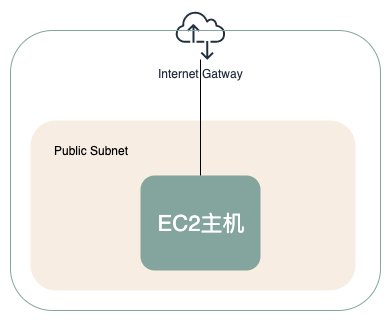
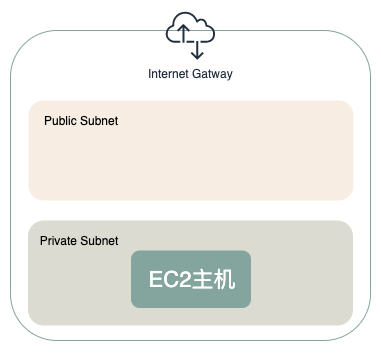
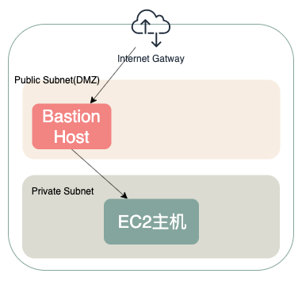
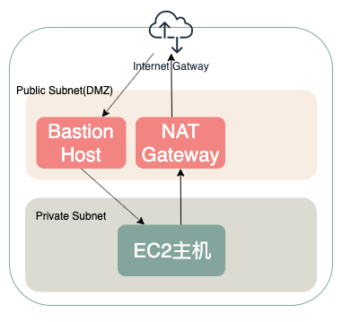
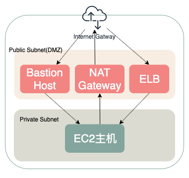

在上一篇文章中[从零搭建AWS网络(一): VPC与Internet Gateway](/aws-vpc-internet-gateway)中，我们学习了如何从零开始搭建一套最简单的AWS网络并通过Internet Gateway来向公网提供服务。在文章的最后我留下了两个问题：
- 没有详细配置Security Group等安全措施，安全性无法得到保障
- 实例直接配置了公网ip地址，缺少安全性和可扩展性，占用宝贵的ip资源

在今天的文章里，我们就来通过添加ELB，NAT Gateway等设施来解决这些问题。

# 1. 网络分层
目前为止，我们只有一层可访问公网的子网`Public Subnet`，整个VPC的结构可以简化地如下表示：

为了达到保护数据/主机安全的目的，我们需要将网络进行分层，把EC2主机从一个可以直接与公网通信的子网中拿出来，单独放入一个与外界隔绝的子网。如下图所示。

我们可以去VPC -> Subnets -> Create Subnet 来新建一个子网，Subnet name填写private-subnet-1。CIDR block可以选择`172.31.1.0/24`, 这个子网的ip分配空间为`172.31.1.0~172.31.1.255`, 与我们在之前文章中配置的Public Subnet的`172.31.0.0/24`完全没有重合。Availability Zone这里就选择与另一个子网相同吧，因为在AWS中，跨AZ通信一般都是要额外收费的，这里我们先不考虑可用性。因为我们不想将这个子网直接与Internet Gateway相连。所以需要给他额外配置一个Route Table。

在VPC -> Route Tables -> Create route table 中创建一个新的路由表，选择我们之前创建的VPC。在在VPC -> Subnets里找到我们刚才创建的`private-subnet-1`并切换到Route Table选项卡，点击Edit route table association来将我们刚才创建的新路由表分配给这个子网。之后我们的EC2主机就可以在这个子网中部署了。

不过由于这个子网并没有网络访问的能力，部署在其中的EC2主机就算分配了公网IP，也不能从外部访问，更不能访问外网。而所有面对公网的能力都被保留在了Public Subnet中。此时Public Subnet可以被称为[DMZ](https://zh.wikipedia.org/wiki/DMZ)(Demilitarized Zone)，也叫边界网络。

# 2. Bastion Host 堡垒机/跳板机
有过开发或者运维经验的同学对`堡垒机/跳板机`一词肯定不陌生。在传统数据中心的网络结构中，也会经常出现这个名词。不管是云原生应用还是传统数据中心，计算资源和数据库部署的网络一般都是与公网隔离以保障安全性的。通过在Public Subnet中部署一个公网可访问的`Bastion Host`，再经由这台跳板机，我们就可以登录到部署在私有子网中的EC2主机了。对于这台跳板机，我们还可以专门设置`Security Group`规则，仅允许你个人电脑的IP以及端口22(SSH)的inbound流量，来保证不被其他人攻击。此时的网络结构变为了下图所示。

AWS有一篇[文章](https://aws.amazon.com/blogs/security/how-to-record-ssh-sessions-established-through-a-bastion-host/)详细地描述了如何创建跳板机，以及一些安全操作，比如对SSH进行audit log，以及对跳板机的SSH秘钥进行管理和更新等。但一个基础的跳板机的创建其实极为简单，仅需要将跳板机部署到Public Subnet，然后将Private Subnet中主机的SSH秘钥上传至跳板机，并且把跳板机以及EC2主机之间的Security Group配置成允许22端口，就能通过跳板机对EC2主机进行SSH登录了。不过登上EC2后你会发现仍然无法访问外网，并且部署在EC2上的服务并不能从公网访问。

# 3. NAT Gateway
由于现在的EC2主机部署在了`Private Subnet`中，给这台机器配置一个公网IP是没有意义的。此时EC2主机的ENI仅分配有一个私网IP。而必须持有公网IP才能访问互联网，那怎么办呢？在上篇文章中介绍过`Internet Gateway`可以通过将子网中的ENI持有的私网IP与公网IP进行双向NAT转换，达成了EC2主机与公网的双向通信。那对于`Private Subnet`中的主机，访问外网就需要一个[NAT Gateway](https://docs.aws.amazon.com/vpc/latest/userguide/vpc-nat-gateway.html)将EC2的私网IP单方向NAT转换为一个公网IP。同时，为了获取一个公网的IP，这个`NAT Gateway`需要与`Internet Gateway`相连，也就是必须部署在`Public Subnet`中。部署了`NAT Gateway`后的网络结构如图：

部署`NAT Gateway`分为两步:
- 在VPC -> NAT gateways -> Create NAT gateway中新建一个`NAT Gateway`，只要选择部署到Public Subnet，并分配一个新的`Elastic IP`即可
- 在VPC -> Route tables里找到分配给Private Subnet的Route table, 点击Edit Routes编辑路由表。点击`Add route`，第一列填入`0.0.0.0/0`代表匹配所有其他ip。第二列选择`NAT Gateway`并选中刚才我们创建好的。

部署完毕`NAT Gateway`后我们的EC2主机就可以访问外网了。我们可以通过跳板机登录上机器后执行`curl ip.sb`，返回的IP地址即我们访问公网使用的IP。这个IP应该与我们分配给`NAT Gateway`的`Elastic IP`保持一致。你可以尝试多部署几台EC2主机在Private Subnet中如下图所示

你会发现所有主机的公网IP都与`NAT Gateway`一致，也就是说`NAT Gateway`将Private Subnet中的私网IP多对一地映射成了自己的`Elastic IP`，节省了IP资源。这里`NAT Gateway`会对outbound流量的网络回包进行处理，送达至对应的私网ip，保证从EC2发出的网络请求响应能顺利送回。但如果直接从公网访问`NAT Gateway`的IP地址，并不能触达私网中的EC2主机。也就是说`NAT Gateway`是一个从内网到公网的“单行道”。

# 4. Elastic Load Balancer
那如何才能安全地对外暴露EC2提供的服务呢？那就需要使用[Elastic Load Balancer](https://aws.amazon.com/elasticloadbalancing/)。顾名思义这是AWS提供的负载均衡器，总共分为三种：`Application Load Balancer`(ALB), `Network Load Balancer`(NLB), 和`Classic Load Balancer`(CLB)。其中ALB是针对7层(HTTP, HTTPS等等)的，NLB是针对4层(TCP, TLS, UDP等等)的，而CLB可以同时提供4层和7层服务，但已经是不被AWS推荐的过期产品，对比较新的功能的支持是有限的。ELB和`Nginx`, `HAProxy`等负载均衡器所提供的功能非常接近，但它是完全由AWS部署运维的，你只需要新建一个ELB并且配置规则即可，不需要考虑它是如何被部署的。
首先，我们去EC2 -> Load Balancers -> Create Load Balancer创建ELB
- 首先我们选择ALB
- Configure Load Balancer:
  - Listeners: 选择默认的HTTP和80端口
  - Availability Zones: 选择我们的VPC以及Public Subnet。如果所选的Subnet没有与`Internet Gateway`相连，这里会给出警告。在当前的版本AWS为了可用性会强制要求ALB部署在两个或者以上的可用区中，可以自行在一个新的可用区新建一个Public Subnet。
- Configure Security Settings: 由于我们选择的是HTTP而不是HTTPS，所以这一步可以略过。如果要暴露HTTPS服务，可以在这一步选择HTTP证书，ALB可以帮你做HTTPS证书卸载，并且支持SNI。
- Configure Security Groups: 选择Create a new security group。默认会为你准备好允许80端口TCP的规则。
- Configure Routing: 使用默认配置即可，新建一个target group。
- Register Targets: 手动选择在Private Subnet中创建的EC2主机

此时我们有了一个指向EC2主机的ALB，对EC2主机，编辑Security Group允许从ALB的Security Group来的所有流量，并且登录到主机上开启一个监听`0.0.0.0:80`的HTTP服务，等待ALB的Health Check健康后就能通过访问ALB提供的DNS域名访问到EC2上部署的HTTP服务了。通过在`Target Group`中部署多台EC2，也可以达到负载均衡的目的，配合[Auto Scaling groups](https://docs.aws.amazon.com/autoscaling/ec2/userguide/AutoScalingGroup.html)更是可以做到弹性伸缩。部署好ELB后的网络结构如图:

# 5. 总结
至此，我们已经搭建了一个出具规模的二层网络，将内部可信流量与外部不可信流量区分开，并且通过`NAT Gateway`与`ELB`为计算资源的弹性伸缩做好了铺垫。从图中我们可以看到，不管是`跳板机`，`ELB`还是`NAT Gateway`，所有的流量都是单向的，并且有自己的目的。我们可以通过配置不通的安全策略来控制每一条路径的安全性，使得整个网络结构安全可控。

在接下来的文章中我们会介绍：
- 如何安全快速地在VPC中访问AWS提供的诸如S3之类的服务？
- 如何在AWS中访问数据库？

