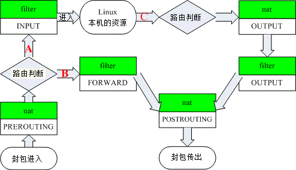

当我们把应用部署在`Kubernetes`集群中的时候可以很方便地使用例如[Istio](https://istio.io/)的`Service Mesh`工具控制集群中的流量，例如熔断，灰度部署，蓝绿部署等功能。虽然当我们的集群部署在docker容器中但又没有Kubernetes环境时`Envoy`和`Istio`等工具仍然可以用来帮助控制集群流量，但是简单的服务熔断/下线等操作可以借助`Iptables`工具快速地实现，而不用侵入应用代码或者部署额外的架构。

# TL;DR
假设我们部署一个简单的docker容器服务[Memcahced](https://hub.docker.com/_/memcached), 将服务暴露的`11211`端口转发至本地的`11211`端口
```bash
docker run memcached:latest -n memcached -p 11211:11211
```
容器memcached的docker子网ip地址为`172.17.0.5`
```bash
docker inspect --format='{{.NetworkSettings.IPAddress}}' memcached #172.17.0.5
```
此时假设本机公网ip为`10.120.0.1`，那么我们向公网暴露了Memcahced服务`10.120.0.1:11211`，而在计算机本地访问Memcahced服务的地址则为`127.0.0.1:11211`。为了将Memcahced向公网和本地暴露的服务全部切断，我们需要使用如下iptables规则
```bash
sudo iptables -I DOCKER-USER -d 172.17.0.5 -j REJECT # 阻断公网向容器发送流量
sudo iptables -I OUTPUT -d 172.17.0.5 -j REJECT # 阻断本地向容器发送流量
```
按照[Docker and iptables](https://docs.docker.com/network/iptables/)官网的示例，阻断外部流量使用第一条规则就能生效，但为什么阻断本地流量需要使用filter表的`OUTPUT`chain呢？背后的原理可能比你想象的要复杂。

# Docker and iptable
关于Iptables的工作原理和结构这边不再赘述，如果不了解的话可以移步[鸟哥的Linux私房菜](http://cn.linux.vbird.org/linux_server/0250simple_firewall.php)的这个章节学习。这里借用一下鸟哥的结构图进行说明(下图去除了mangle表)


那docker对iptables进行了哪些修改呢？在拉起memcached服务之后我们可以在机器上运行`iptables -L -nv`进行详细查看。


## 从外部请求服务
我们知道menmcached协议是基于http/1.1的。假设我们在外部的某台机器上发起了`curl 10.120.0.1:11211`
```bash
# curl 10.120.0.1:11211
curl: (52) Empty reply from server
```
那这个请求在iptable中走过了怎样的一个流程呢？

按照Iptables的顺序，我们先查看`PREROUTING` chain
```bash
# sudo iptables -t nat -nv -L PREROUTING
Chain PREROUTING (policy ACCEPT 1449K packets, 106M bytes)
 pkts bytes target     prot opt in     out     source               destination         
  24M 1282M DOCKER     all  --  *      *       0.0.0.0/0            0.0.0.0/0            ADDRTYPE match dst-type LOCAL
```
这里docker添加的规则非常简单。对于外部请求本地的流量转由`Docker` chain处理。
```bash
# sudo iptables -t nat -nv -L DOCKER
Chain DOCKER (2 references)
 pkts bytes target     prot opt in     out     source               destination         
20626 1670K RETURN     all  --  docker0 *       0.0.0.0/0            0.0.0.0/0           
32712 1772K DNAT       tcp  --  !docker0 *       0.0.0.0/0            0.0.0.0/0            tcp dpt:11211 to:172.17.0.5:11211
```
在NAT表上的Docker链也非常简单，一共有两条规则：
- 所有input interface设备为`docker0`，也就是发往docker网络内部的流量直接返回，不进行进一步判断
- 所有不发网docker网络的流量，如果是`tcp`连接并且端口为11211的，DNAT转发至`172.17.0.5:11211`，也就是memcached的容器内部。

值得注意的是这和`DOCKER` chain有两个references。除了`PREROUTING` chain之外，`OUTPUT` chain也使用了这条自定义chain。我们下面再讨论这条链。

很明显经过`PREROUTING`之后我们的请求被DNAT到了172.17.0.5:11211，那么下一步就应该由`filter`表的`FORWARD` chain过滤请求了。
```bash
 # sudo iptables -nv -L FORWARD
Chain FORWARD (policy ACCEPT 0 packets, 0 bytes)
 pkts bytes target     prot opt in     out     source               destination         
 237M   23G DOCKER-USER  all  --  *      *       0.0.0.0/0            0.0.0.0/0           
 237M   23G DOCKER-ISOLATION-STAGE-1  all  --  *      *       0.0.0.0/0            0.0.0.0/0           
 102M 9905M ACCEPT     all  --  *      docker0  0.0.0.0/0            0.0.0.0/0            ctstate RELATED,ESTABLISHED
  23M 1252M DOCKER     all  --  *      docker0  0.0.0.0/0            0.0.0.0/0           
 111M   12G ACCEPT     all  --  docker0 !docker0  0.0.0.0/0            0.0.0.0/0           
    1    52 ACCEPT     all  --  docker0 docker0  0.0.0.0/0            0.0.0.0/0   
```
可以看到这里的规则就比较多了，但是我们只需要关心其中几条就可以了
- DOCKER-USER: 所有的请求都会先交给这条链处理，这也是Docker 18.x新增的链，专门用于给用户扩展自定义的请求过滤规则
- DOCKER-ISOLATION-STAGE-1: Docker本身的网络隔离相关，这里不深究
- DOCKER: Docker自身对流量的控制，这里不深究

而我们最终的规则之一就是按照Docker官方的建议加到了`DOCKER-USER`链中。

最后在`POSTROUTING`链中主要是一些SNAT的规则，与我们这次讨论的服务熔断无关。
```bash
# sudo iptables -t nat -nv -L POSTROUTING
Chain POSTROUTING (policy ACCEPT 6566K packets, 349M bytes)
 pkts bytes target     prot opt in     out     source               destination         
8226K  584M MASQUERADE  all  --  *      !docker0  172.17.0.0/16        0.0.0.0/0           
    0     0 MASQUERADE  tcp  --  *      *       172.17.0.5           172.17.0.5           tcp dpt:11211
```
那么我们想熔断对外部暴露的服务，只需要增加规则
```bash
sudo iptables -I DOCKER-USER -d 172.17.0.5 -j REJECT
```
这样的话在`FORWARD`链中就能正确过滤请求了。
```bash
 # curl 10.120.0.1:11211
curl: (7) Failed to connect to 10.120.0.1 11211: Connection refused
```
那我们成功得完全将该服务熔断了吗？并不是。如果本地跑了其他服务想请求memached的服务，似乎熔断并没有生效。
```bash
 # curl localhost:11211
curl: (52) Empty reply from server
```


## 从本地请求服务

本地发起的服务`curl localhost:11211`最先进入的iptable chain是`nat`表的`OUTPUT`链
```bash
# sudo iptables -t nat -nv -L OUTPUT
Chain OUTPUT (policy ACCEPT 2669K packets, 139M bytes)
 pkts bytes target     prot opt in     out     source               destination         
3305K  172M DOCKER     all  --  *      *       0.0.0.0/0           !127.0.0.0/8          ADDRTYPE match dst-type LOCAL
```
像上文所说，这里的`OUTPUT`链也引用了`DOCKER`链做DNAT转发。

**等等，好像有哪里不太对劲。**这条规则对于请求的`destination`的要求是`!127.0.0.0/8`。我们知道`localhost`的destination是`127.0.0.1`，不符合这条规则的要求，我们的请求并没有被DOCKER链处理。实际上对本地的请求分为两种，一种是直接请求`127.0.0.1`，另一种是请求自身的公网ip`10.120.0.1`。显然第二种情况就会被这个`OUTPUT`链上的规则匹配，进而进行DNAT。但是对于直接对`localhost`的请求，并没什么特殊的处理。

### 对localhost的请求

我们先讨论第一种情况，对于`localhost`的请求没有被`NAT OUTPUT`链处理，而`FILTER OUTPUT`链docker也没有进行修改，最后保持`localhost:11211`这个状态就走出了`POSTROUTING`链。

然而这个请求是针对本地的，还会从本地的iptables入口进入一次。**并且这种对本地的请求不会经过PREROUTING链**，就导致了最终进入了`INPUT`链进行处理。同样的，Docker也没有对该链进行修改。

随后我们的这条请求就被监听本地`11211`端口的程序处理了(换句话说，其他情况下根本不会走到本地监听端口，而是直接在iptables中被DNAT了)
```bash
# sudo lsof -i:11211
docker-pr 4714 root    4u  IPv6     37763      0t0  TCP *:memcache (LISTEN)
```
可以看到这里被一个叫docker-pr的进程监听了，也就是`docker-proxy`。他将请求代理转发到了对应的容器端口，也就是`172.17.0.5:11211`。经过转发之后的流量再走过一遍`NAT OUTPUT`, `FILTER OUTPUT`和`POSTROUTING`链后，被容器接收。

### 对公网ip的请求

与对`localhost`的请求不用，直接访问自身公网ip的请求被`NAT OUTPUT`定向到`NAT DOCKER`链进行DNAT转换，直接从`10.120.0.1:11211`被转发到了`172.17.0.5:11211`。经由`FILTER OUTPUT`和`POSTROUTING`发送到了容器内部，并没有进入到本地监听的`11211`端口中。

总结一下两种本地请求的iptables链路：
- localhost: OUTPUT(N) -> OUTPUT(F) -> POSTROUTING -> INPUT -> docker-proxy -> OUTPUT(N) -> OUTPUT(F) -> POSTROUTING -> container
- 10.120.0.1: OUTPUT(N) -> OUTPUT(F) -> POSTROUTING -> container

显然`localhost`请求走两圈iptables，链路比公网ip长了一倍。而两者的链路中，都会走过的`Filter`表的部分是`OUTPUT`链，其中`localhost`请求走了两次，第一次的请求地址是`127.0.0.1:11211`而第二次的是`172.17.0.5:11211`。所以两种请求都会以为`172.17.0.5:11211`的身份走过一次`filter OUTPUT`链。所以我们最终决定把规则放在这个位置。
```bash
sudo iptables -I OUTPUT -d 172.17.0.5 -j REJECT
# curl -v localhost:11211
* Rebuilt URL to: localhost:11211/
*   Trying 127.0.0.1...
* TCP_NODELAY set
* Connected to localhost (127.0.0.1) port 11211 (#0)
> GET / HTTP/1.1
> Host: localhost:11211
> User-Agent: curl/7.58.0
> Accept: */*
> 
* Recv failure: Connection reset by peer
* Closing connection 0
curl: (56) Recv failure: Connection reset by peer
 # curl -v 10.120.0.1:11211
* Rebuilt URL to: 10.120.0.1:11211/
*   Trying 10.120.0.1...
* TCP_NODELAY set
* connect to 10.120.0.1 port 11211 failed: Connection refused
* Failed to connect to 10.120.0.1 11211: Connection refused
* Closing connection 0
curl: (7) Failed to connect to 10.120.0.1 port 11211: Connection refused
```
可以看到两种请求都失败了，但是我们这次开启了`curl -v`查看详细的握手过程。可以看到对`localhost`的请求成功建立了tcp连接之后才失败。这是因为对于该请求而言，先与`docker-proxy`建立了连接，而`docker-proxy`代理的请求在走过第二次iptables的时候失败了。相比较下`10.120.0.1`的请求并没有建立tcp连接，是因为其在`nat OUTPUT`链中已经被DNAT转发到容器中了，所以并没有和`docker-proxy`建立连接。

此时从外部访问memcahed请求并没有受到影响，因为外部的请求走的是`PREROUTING` -> `FORWARD` -> `POSTROUTING`链路，不经过`filter OUTPUT`链。

# 总结
综上所述，我们可以得出结论，如果想要对某个docker容器完全阻断从本地以及外部发送来的请求，我们需要至少两个iptables规则
```bash
sudo iptables -I DOCKER-USER -d <container_ip> -j REJECT # 阻断公网向容器发送流量
sudo iptables -I OUTPUT -d <container_ip> -j REJECT # 阻断本地向容器发送流量
```
同时我们也有一个有趣的发现：除了以`localhost`的方式向容器发送的流量外，其他形式的请求并不会走到监听了本地端口的`docker-pr`。在做trouble shooting的时候需要针对症状找对方向。