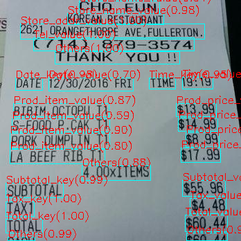

在上篇文章[Windows环境下利用WSL搭建GPU训练/推理PaddlePaddle神经网络环境](/cuda-gpu-setup-for-paddle-on-windows-wsl)中我们简单介绍了如何在Windows的WSL2环境中搭建PaddlePaddle的GPU训练/推理环境，那么这次就来结合代码一起来看看PaddleOCR中KIE模块: SDMGR网络的代码与如何推理/训练吧。

# 1. 什么是KIE任务与SDMGR网络
KIE(Key Infomation Extraction)即关键信息提取是计算机视觉任务中的一种，目的是在给定的图片以及其他信息中提取关键信息。例如这次要介绍的SDMGR网络，在给定图片以及图片中文字的位置和内容后，可以给文字信息分类。比如在[WildReceipt](https://paperswithcode.com/dataset/wildreceipt)这个英文小票的数据集上训练好的SDMGR模型，可以在给定图片和文字后提取出如下信息：



可以看到在图中标红的部分就是对小票OCR出的文字框的分类，目前这个预训练的模型可以较为准确地识别英文小票中店名，店地址，商品名，单价，总价，税额之类的关键信息。由于SDMGR网络专注于在双模态(即图片与文字信息)中提取关键信息，在使用前需要对整张图片进行一次OCR来获得文字的内容和位置信息。


[SDMGR/SDMG-R](https://arxiv.org/abs/2103.14470v1)(Spatial Dual-Modality Graph Reasoning for Key Information Extraction)网络的论文是2021年由商汤递交，默认的实现在[MMOCR](https://github.com/open-mmlab/mmocr)中。该网络的名字念起来比较拗口，我们先来看一眼整个网络的结构：


总的来说网络分为三个层次：

1. Backbone部分一方面使用[U-Net](https://arxiv.org/abs/1505.04597)卷积网络提取图片的视觉特征，经过一个`ROI Pooling`抽取对应各个文字框的特征图，另一方面使用[双向LSTM](https://paperswithcode.com/method/bilstm)(实际代码不论PaddleOCR还是MMOCR，都使用了LSTM而不是Bi-LSTM)提取文字特征。最后使用`Kronecker乘积`结合了视觉特征和文字特征输出给后续模块
2. Neck部分将结合后的特征作为节点放入一个图神经网络进行迭代，而图网络的边则是由文字节点之间的空间信息构成的。
3. Head部分将图网络的节点和边输出各过了一个全连接层转换到对应分类的数量，最后通过一个`softmax`输出分类结果。

结合整个网络的结构，论文的几个关键字就好理解了：

1. Spatial: 指文字节点间的空间信息，用于图神经网络中的边
2. Dual-Modality：双模态指的是视觉和文字信息，分别抽取后做`Kronecker乘积`形成图神经网络中的节点
2. Graph Reasoning：利用图推理模模块的迭代来优化节点特征

对于论文更详细的解读可以参考B站视频
- [AI论文精读之SDMGR](https://www.bilibili.com/video/BV1K44y1M7ah)

以及两篇文章

- [论文阅读: Spatial Dual-Modality Graph Reasoning for Key Information Extraction (关键信息提取算法)](https://blog.csdn.net/shiwanghualuo/article/details/122315487)
- [SDMGR模型学习笔记](https://blog.csdn.net/sinat_33455447/article/details/122987871)

我们也会在之后的文章中对PaddleOCR中的代码实现进行精读。

# 2. 模型配置概览

在PaddleOCR中，每个模型除了代码实现之外，还需要一个配置文件将各个模块组织起来，这样就可以利用PaddleOCR自带的训练工具进行训练了。而这个配置文件则是带领我们认识整个模型最好的切入点。在阅读代码或是下载预训练模型进行推理之前，让我们阅读一下SDMGR网络的配置文件吧

由于有一部分配置文件指向了数据集中文件，不妨先下载数据集

```bash
# 进入项目
cd PaddleOCR/
# 下载wildreceipt数据集并解压
wget https://paddleocr.bj.bcebos.com/dygraph_v2.1/kie/wildreceipt.tar && tar xf wildreceipt.tar
# 将数据集链接至train_data目录下
mkdir train_data && cd train_data
ln -s ../../wildreceipt ./
```

接下来我们来看配置文件: `configs/kie/kie_unet_sdmgr.yml` (以下代码仅保留关键部分)

```yaml
Global:
  ...
  # 信息分类文件
  class_path: ./train_data/wildreceipt/class_list.txt
  # 图片缩放大小
  img_scale: [ 1024, 512 ]

Architecture:
  ...
  Backbone:
    # ppocr/modeling/backbones/kie_unet_sdmgr.py
    name: Kie_backbone
  Head:
    # ppocr/modeling/heads/kie_sdmgr_head.py
    name: SDMGRHead
    # 添加以下两个参数来适配自定义的字典文件与分类文件
    # num_chars: 92
    # num_classes: 26

Loss:
  # ppocr/losses/kie_sdmgr_loss.py
  name: SDMGRLoss

Optimizer:
  # ppocr/optimizer/optimizer.py
  name: Adam
  ...
...

Metric:
  # ppocr/metrics/kie_metric.py
  name: KIEMetric
  main_indicator: hmean

Train:
  dataset:
    ...
    label_file_list: [ './train_data/wildreceipt/wildreceipt_train.txt' ]
    ratio_list: [ 1.0 ]
    transforms:
      ...
      - KieLabelEncode:
          # 字典文件
          character_dict_path: ./train_data/wildreceipt/dict.txt
      # 使用Global.img_scale的配置对图片缩放
      - KieResize:
      - ToCHWImage:
      ...

Eval:
  dataset:
    ...
```

我们逐条来看各个配置包含的信息:

- Global
  - `class_path`: 指向了分类文件，该文件每一行代表了最终对文字的一个分类。默认的wildreceipt数据集有26个分类，如果你希望训练自己的模型，那么你大概率需要自己定义一个文件包含你所有的class。 **特别注意：如果你修改了class的数量，需要同时修改`SDMGRHead`初始化的`num_classes`参数以及`KIEMetric`中`compute_f1_score`的`ignores`。在下文中会详细介绍**
  - `img_scale`: 将图片的长边限制在1024像素，短边限制在512像素，这个选项仅在`Train.dataset.transforms.KieResize`启用时生效
- Architecture
  - `Backbone`: 整个Backbone代码的位置在`ppocr/modeling/backbones/kie_unet_sdmgr.py`，与上文中图片划分出网络的三个模块不同，代码中的Backbone仅包含U-Net卷积网络，并不包含文字的处理。
  - `Head`: 代码位置在`ppocr/modeling/heads/kie_sdmgr_head.py`由于没有代码没有Neck层，`LSTM`，`Kronecker乘积`，图推理和最后的两个全连接代码全在Head模块中了。这个模块也是整个网络中最重要的模块，如果修改了class数量或者文字embedding用字典文件，都需要修改配置文件添加`num_chars`和`num_classes`参数，下文中会详细介绍。
- Loss: 代码位置在`ppocr/losses/kie_sdmgr_loss.py`，分别对网络中输出的`node`和`edge`做交叉熵loss并相加获得总loss(默认权重都是1)。
- Optimizer： 默认使用Adam作为优化器
- Metric: 代码位置在`ppocr/metrics/kie_metric.py`。评估模型使用了节点的[F1-score](https://en.wikipedia.org/wiki/F-score)，即对文字分类的精度(precision)和召回(recall)做了调和平均。需要注意的是部分类在计算F1时被忽略了，包括了`Ignore`，`Other`以及各种key，如果你修改了class文件，那么也要相应地调整`ppocr/metrics/kie_metric.py`中的`ignores`数组。
- Train
  - `label_file_list`: 指向了训练数据集，PaddleOCR版本的数据集使用了类似于`tsv`格式，即`图片位置\t标号`。
  - `ratio_list`: 如果指定了多个`label_file`, 则可以分别指定各个`label_file`在每个训练epoch中采样的比例。
  - `transforms`:
    - `KieLabelEncode`: 指定了用于embedding文字信息的字典文件位置。Wildreceipt数据集自带了英文字典文件，如果你希望使用中文字典，可以使用PaddleOCR自带的中文字典`ppocr/utils/ppocr_keys_v1.txt`。需要注意如果修改了字典文件，配置文件中`SDMGRHead`的参数`num_chars`参数为`字典长度 + 1`。如果你使用了`ppocr_keys_v1.txt`，那么这个值是6624。
- Eval: 基本同`Train`

# 3. 使用模型

首先让我们在wildreceipt数据集上跑一下预训练模型把。数据集在上面已经下载过了，我们直接来下载模型参数：
```bash
# 进入项目位置
cd PaddleOCR
# 下载并解压预训练参数
wget https://paddleocr.bj.bcebos.com/dygraph_v2.1/kie/kie_vgg16.tar && tar xf kie_vgg16.tar
```
完成后预训练参数在`kie_vgg16`目录下。比较关键的两个文件`kie_vgg16/best_accuracy.pdopt`和`kie_vgg16/best_accuracy.pdparams`分别是优化器参数和模型参数。由于SDMGR的模型源码是本地的python文件，就不需要再下载一个模型文件了。

现在使用自带的infer工具可以进行推理：
```bash
cd PaddleOCR
python tools/infer_kie.py -c configs/kie/kie_unet_sdmgr.yml -o Global.checkpoints=kie_vgg16/best_accuracy  Global.infer_img=train_data/wildreceipt/1.txt
```
此处`-o`可以覆盖指定config文件中的配置。这里使用`kie_vgg16`下`best_accuracy`为前缀的两个参数文件推理模型，并将结果储存在`output/sdmgr_kie/kie_results`中。打开该文件夹即可看到图片推理的结果。

同样的，使用工具也可以在数据集上训练模型:
```bash
python tools/train.py -c configs/kie/kie_unet_sdmgr.yml -o Global.save_model_dir=./output/kie/
```
需要注意的是模型训练时对显存压力比较大，`batchSize`为1的情况也要消耗约5-6G的显存。如果训练过程中显存爆了可以酌情降低配置文件中的`Train.loader.batch_size_per_card`选项。

在动手尝试过后，让我们认识一下数据文件的格式吧。PaddleOCR所使用到的训练集，验证集和测试集分别是`train_data/wildreceipt/wildreceipt_train.txt`, `train_data/wildreceipt/wildreceipt_test.txt`和`train_data/wildreceipt/1.txt`。这三个文件的格式都是一样的。每一行代表一条数据，格式为`图片位置\t标号`。图片位置信息比较好理解，图片标号则是一个JSON Array, Array中每一项代表一条文字信息以及其位置信息。将这个JSON格式化后如下:
```json
[
    {
        "label": 1,
        "transcription": "ILIO'S",
        "points": [
            [
                372.0,
                242.0
            ],
            [
                479.0,
                242.0
            ],
            [
                479.0,
                178.0
            ],
            [
                372.0,
                178.0
            ]
        ]
    },
    ...
]
```
可以看到每个文字标号包含三个key：
- label：文字的分类，与class文件中的分类一一对应。例子中的`1`就对应了`Store_name_value`。
- transcription： 文字内容
- points：文字坐标，从左上角顺时针排列

训练、验证、测试集的格式都是一样的，上文尝试在`train_data/wildreceipt/1.txt`数据集上进行推理，而该文件的每个标号上都已经含有正确的`label`，并且如果将`label`这项去掉，模型会因缺少参数报错。也就意味着要进行推理，我要实现知道各个文字的分类，岂不是很奇怪？其实这里的`label`只是为了满足模型参数的输入形状，实际上模型并不会真的在推理的收去看这一项。也就是说在进行推理的时候，`label`字段随便填一个值就可以了，并不会影响结果。

# 4. 应用模型

模型自带的预训练参数效果很不错，但是应用场景也仅仅是对英文小票的识别而已。如何将这个模型应用到其他领域呢？总的来说，有以下几个步骤。

## 4.1 制作分类文件

在制作数据集前应当先确定任务的目标：需要将图片中的文字分成哪些类？wildreceipt数据集中的分类又主要分为四种：

- Ignore: 如果文字内容为空则没有意义，应当标注为`Ignore`
- Others: 该文字内容并不是关键信息，则标注为`Others`，即负类
- Keys: 如果你要提取的关键信息是Key-Value pair，那么标注的时候可以将`Key`单独标注，比如`Store_name_key`，不过Keys在验证阶段是不参与计算`F1 score`的。虽然对最终提取出的关键信息来说，`Keys`是没有价值的，但是论文中提到对`Keys`的正确识别可以提升关键信息`Values`识别的准确率。
- Values: 这就是你希望提取的关键信息了。

在以上四大类中，`Ignore`， `Others`和`Keys`都是不参与模型评估的，也就是说模型的`F1 score`是完全取决于Values的分类精度和召回。**决定一个class是不是参与模型验证的是`ppocr/metrics/kie_metric.py`中`compute_f1_score`函数的`ignores`数组**。 默认`ignores = [0, 2, 4, 6, 8, 10, 12, 14, 16, 18, 20, 22, 24, 25]`就一一对应了`train_data/wildreceipt/class_list.txt`中的`Ignore`， `Others`和`Keys`。**如果你不修改这个数组来对应你自己的class文件，那么很可能模型验证阶段给出的`F1 score`是不正确的**

另外配置文件中`Architecture.Head.num_classes`参数也要被修改为`class数 + 1`。

## 4.2 制作数据集

制作数据集自然是最重要的步骤。需要注意的是SDMGR模型在推理阶段需要很多的数据，包括图片，文字信息和文字位置。在推理阶段文字信息和文字位置大概率是从某个前置的OCR网络中输出出来的。这也就意味着在制作数据集的阶段，文字内容和位置信息最好也使用与未来推理阶段相同的OCR网络来生成，最后再手动对各个文字框进行标号。如果制作数据集时手动画了文字的边界框以及标注文字内容，那么很容易造成模型训练完后推理时受OCR输出的结果不准确而影响分类的效果。

## 4.3 选择合适的字典

如果你的任务中文字是英文加常见标点，那么可以直接使用wildreceipt自带的字典文件，也不需要修改代码。但如果你的任务涉及到其他语言或者符号，那么就需要使用对应的字典了。PaddleOCR内置了包括中文，日语，韩文，法文，德文等在内的字典文件，具体位置可以参考[文档](https://github.com/PaddlePaddle/PaddleOCR/blob/release/2.5/doc/doc_ch/recognition.md)。在修改字典文件后要记得同时修改配置文件中`Architecture.Head.num_chars`参数为`字典长度 + 1`，这样输入的文字才能正确地被embedding。

# 5.总结

今天这篇文章从模型配置的角度介绍了`PaddleOCR`中实现的`SDMGR`关键信息提取网络总体的代码框架，以及在实践过程中的一些坑。下一篇文章会从更详细的代码角度逐个模块地讲解整个网络。

[关键信息提取网络SDMGR代码详解(2): 数据处理与主干网络](/paddle-ocr-kie-sdmgr-code-data-process-and-backbone)

[关键信息提取网络SDMGR代码详解(3): 循环神经网络与图神经网络](/paddle-ocr-kie-sdmgr-code-embedding-lstm-and-gnn)

[关键信息提取网络SDMGR代码详解(4): 损失函数与模型评估](/paddle-ocr-kie-sdmgr-loss-and-evaluation)

### 参考链接
1. https://arxiv.org/abs/2103.14470v1
2. https://github.com/open-mmlab/mmocr
3. https://arxiv.org/abs/1505.04597
4. https://paperswithcode.com/method/bilstm
5. https://www.bilibili.com/video/BV1K44y1M7ah
6. https://paperswithcode.com/dataset/wildreceipt
7. https://en.wikipedia.org/wiki/F-score

