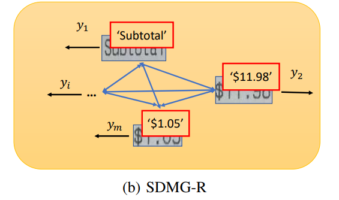

在[上篇文章](/paddle-ocr-kie-sdmgr-code-overview-and-application)中我们简单介绍了[PaddleOCR](https://github.com/PaddlePaddle/PaddleOCR)中用于关键信息提取(KIE)任务网络[SDMGR](https://arxiv.org/abs/2103.14470v1)(Spatial Dual-Modality Graph Reasoning for Key Information Extraction)并且手动尝试使用预训练模型对[WildReceipt](https://paperswithcode.com/dataset/wildreceipt)数据集进行了推理。那这篇文章我们就从头开始对`SDMGR`网络的代码实现逐步解读一下吧。

# 1. 数据处理
回顾一下上篇文章中对`SDMGR`网络的训练/推理数据结构：每一行代表一条数据，格式为`图片位置\t标号`。图片位置信息比较好理解，图片标号则是一个JSON Array, Array中每一项代表一条文字信息以及其位置信息。将这个JSON格式化后如下:
```json
[
    {
        "label": 1,
        "transcription": "ILIO'S",
        "points": [
            [
                372.0,
                242.0
            ],
            [
                479.0,
                242.0
            ],
            [
                479.0,
                178.0
            ],
            [
                372.0,
                178.0
            ]
        ]
    },
    ...
]
```
那么SDMGR网络使用了“双模态”数据，即图片与文字标号，那么自然需要对这两种不同的数据进行预处理才能输入到神经网络中。在配置文件`configs/kie/kie_unet_sdmgr.yml`中的`Train.dataset.transforms`就定义了各个处理数据的步骤（训练和推理的预处理步骤几乎相同，这里先介绍训练的部分）。

## 1.1 DecodeImage
代码位置: `ppocr/data/imaug/operators.py#DecodeImage`。这步是标准的读取图片操作。参数`img_mode=RGB`和`channel_first=False`代表了以RGB三通道的方式使用`cv2`读取图片。最终图片的读取出图片的形状为`[1, 1, 3]`，即高度维，宽度维和通道维。

## 1.2 NormalizeImage
代码位置: `ppocr/data/imaug/operators.pyy#NormalizeImage`。这一步仅仅发生在训练阶段，从配置上来看这一步做的事是将图片RGB通道上的数据分别减去均值`[ 123.675, 116.28, 103.53 ]`除以标准差`[ 58.395, 57.12, 57.375 ]`。这里的参数`scale=1`，意味着各个像素的值保持了原始的0~255的大小减去均值除以标准差。
```python
data['image'] = (img.astype('float32') * self.scale - self.mean) / self.std
```
那么这些“神奇”的数字是哪里来的，又为什么要进行图片的标准化呢？简单地说这些数值是数据集[ImageNet](https://image-net.org/)上图片的和标准差。ImageNet是计算机视觉领域最著名的数据集之一，包含了超过1400万的图像和超过2万个对应的同义分类。有数量庞大的预训练模型是基于ImageNet数据集，ImageNet所对应的均值和标准差也自然而然地出现在各个地方。如果这里不传参数`scale=1`，那么每个像素的数值都会被除以255，拉到了0~1这个范围内。此时对应的标准差和均值则要除以255。分别为`[0.485, 0.456, 0.406]` 和 `[0.229, 0.224, 0.225]`，这也是ImageNet数据集均值和标准差的另一种著名形式。

对图片做标准化可以将图片各个通道的数值分别拉到均值为0，方差为1的范围内。因为神经网络中的卷积层在前向计算时间会将各个通道的数值经过卷积核的卷积计算后进行加和输出到输出通道中，所以当两个通道的数据相差比较大时，反向传递梯度的时候也会导致梯度分配不均导致梯度方向不稳定。**所以为了使得图片最终的均值为0，方差为1，这里实上要将减去的均值和除以的标准差替换为训练模型所使用数据的对应值，而不能直接使用ImageNet的均值和标准差。** 关于卷积神经网络的图片标准化，更详细的内容可以参考[这篇文章](https://zhuanlan.zhihu.com/p/35597976)

截至这一步，图片信息已经被处理为了形状为[1, 1, 3]，各个通道上均值为0方差为1的张量。

## 1.3 KieLabelEncode
代码位置: `ppocr/data/imaug/label_ops.py#NormalizeImage`。这一步进入了对文字标签的处理，包含了空间信息和语义信息，所以代码会比较多，我们一步一步来看。

首先，将标号的json字符串反序列化，处理空间的信息
```python
def __call__(self, data):
    import json
    label = data['label']
    # 将标号的json字符串反序列化
    annotations = json.loads(label)
    boxes, texts, text_inds, labels, edges = [], [], [], [], []
    for ann in annotations:
        # 获取标号中边界框的坐标
        box = ann['points']
        # 提取四个坐标的X轴值
        x_list = [box[i][0] for i in range(4)]
        # 提取四个坐标的Y轴值
        y_list = [box[i][1] for i in range(4)]
        # 从左上角开始，顺时针排序各个坐标点
        sorted_x_list, sorted_y_list = self.sort_vertex(x_list, y_list)
        sorted_box = []
        # 重新将排序后X轴，Y轴数组转换为点的数组
        for x, y in zip(sorted_x_list, sorted_y_list):
            sorted_box.append(x)
            sorted_box.append(y)
        boxes.append(sorted_box)
```
获得排序好的边界框后，开始处理文字信息
```python
      # 获取文字标号
      text = ann['transcription']
      texts.append(ann['transcription'])
      # 将文字转换为字典文件中的序号，例如WildReceipt数据集的字典中，j将会被转换为数字49
      text_ind = [self.dict[c] for c in text if c in self.dict]
      text_inds.append(text_ind)
      # 提取标号中的分类信息
      if 'label' in ann.keys():
          labels.append(ann['label'])
      elif 'key_cls' in ann.keys():
          labels.append(ann['key_cls'])
      else:
          raise ValueError("Cannot found 'key_cls' in ann.keys(), please check your training annotation.")
      # 提取标号中的edge信息，但实际WildReceipt数据集中并未提供该标号
      edges.append(ann.get('edge', 0))
  ann_infos = dict(
      image=data['image'],
      points=boxes,
      texts=texts,
      text_inds=text_inds,
      edges=edges,
      labels=labels)

  return self.list_to_numpy(ann_infos)
```

对文字信息的处理获得了每个边界框对应的文字数组`texts`，转换为坐标的文字数组`text_inds`，分类信息数组`labels`和边信息数组`edges`(实际数据集中未给出)结合空间信息处理过的有序的边界框数组`boxes`，进入`list_to_numpy`方法进行进一步的处理。

```python
def list_to_numpy(self, ann_infos):
    """Convert bboxes, relations, texts and labels to ndarray."""
    boxes, text_inds = ann_infos['points'], ann_infos['text_inds']
    boxes = np.array(boxes, np.int32)
    # 计算边界框之间的关系
    relations, bboxes = self.compute_relation(boxes)

    labels = ann_infos.get('labels', None)
    if labels is not None:
        labels = np.array(labels, np.int32)
        edges = ann_infos.get('edges', None)
        if edges is not None:
            # 给labels添加一个新的维度，shape从[n]变为[n, 1]
            labels = labels[:, None]
            edges = np.array(edges)
            # 将edge从一维数组变为一个n*n的矩阵，每一行代表这条边的标号是否与其他边相同。对角线为1
            edges = (edges[:, None] == edges[None, :]).astype(np.int32)
            if self.directed:
                edges = (edges & labels == 1).astype(np.int32)
            np.fill_diagonal(edges, -1)
            # 将labels转换为列向量后和edges矩阵拼接，拼接后的形状为[n, n+1]
            labels = np.concatenate([labels, edges], -1)
    # 由于每个文字标号的长度都不一样，将每个文字标号的长度都调整为300，不足的用-1补齐。recoder_len是最长的文字长度。
    padded_text_inds, recoder_len = self.pad_text_indices(text_inds)
    max_num = 300
    # 初始化[300, 4]的矩阵存放边界框
    temp_bboxes = np.zeros([max_num, 4])
    h, _ = bboxes.shape
    # 将边界框填入上述的容器，不足的位置以0补齐
    temp_bboxes[:h, :] = bboxes

    # 初始化[300, 300, 5]的张量存放边界框之间的关系
    temp_relations = np.zeros([max_num, max_num, 5])
    # 填入关系
    temp_relations[:h, :h, :] = relations

    # 初始化[300, 300]的矩阵存放文字
    temp_padded_text_inds = np.zeros([max_num, max_num])
    # 填入文字
    temp_padded_text_inds[:h, :] = padded_text_inds

    # 初始化[300, 300]的矩阵存放标签(包括边信息)
    temp_labels = np.zeros([max_num, max_num])
    # 存入标签信息
    temp_labels[:h, :h + 1] = labels

    tag = np.array([h, recoder_len])
    return dict(
        image=ann_infos['image'],
        points=temp_bboxes,
        relations=temp_relations,
        texts=temp_padded_text_inds,
        labels=temp_labels,
        tag=tag)
```
经过上面的代码，每一条数据的标号数量都被限制在300个并处理成了相同的形状。最终得到了一下几个处理完的数据：
- image： 此步未被处理
- points： 形状为[300, 4]，第二个维度是每个边界框左上点的X,Y值和右下点的X,Y值
- relations：形状为[300, 300, 5]，前两个维度代表了每一条标号的边界框之间两两关系，最后一个维度5代表每个关系的特征数。关系特征是如何得到的将在下文解释
- texts：形状为[300, 300]，每个文字标号也被限制了300的长度
- labels：形状为[300, 300]，第一列为每个文字框的分类，后面的列为边与边之间的对应关系(由于WildReceipt数据集没有给edges，实际这里只有第一列)
- tag: 形状为[2], 第一个数字为该条数据总标号数量，第二个数字为标号中最长的文字长度。

其中，relations的计算是SDMGR论文中的一个关键点，即如何将两个点之间的关系转化为一个向量表示呢？首先我们来看一下论文中的公式是如何描述的。


然后我们结合代码来看一下
```python
def compute_relation(self, boxes):
    """Compute relation between every two boxes."""
    # 所有边界框左上角点的X,Y轴值, 形状都是[n, 1]
    x1s, y1s = boxes[:, 0:1], boxes[:, 1:2]
    # 所有边界框右下角点的X,Y轴值, 形状都是[n, 1]
    x2s, y2s = boxes[:, 4:5], boxes[:, 5:6]
    # ws是同一个框右下X减去左上X，即宽度。+1防止ws是0
    # hs是右下Y减去左上Y，但是最大限制为1
    # ws和hs的形状都是[n, 1]
    ws, hs = x2s - x1s + 1, np.maximum(y2s - y1s + 1, 1)
    # self.norm为常数10
    # x1s[:, 0][None]的形状是[1, n]减去x1s利用了广播机制，变为了[n, n]的矩阵，dxs代表了所有框两两之间X轴的距离。
    # 同样的，dys代表了Y轴上的记录，他们都除以了归一化常数10.
    dxs = (x1s[:, 0][None] - x1s) / self.norm
    dys = (y1s[:, 0][None] - y1s) / self.norm
    # 同样的， hs[:, 0][None] / hs利用广播机制形成了[n, n]的矩阵，xhhs代表了所有框两两之间的高度比
    # 而xwhs则代表两两之间的宽高比
    xhhs, xwhs = hs[:, 0][None] / hs, ws[:, 0][None] / hs
    # whs则代表了当前框自身的宽高比
    whs = ws / hs + np.zeros_like(xhhs)
    # 将上述五个特征按每两个边界框之间的关系放入一个数组，形成shape为[n, n, 5]的张量
    relations = np.stack([dxs, dys, whs, xhhs, xwhs], -1)
    # 将左上X,Y,右下X,Y作为一组向量代表一个边界框，形状为[n, 4]
    bboxes = np.concatenate([x1s, y1s, x2s, y2s], -1).astype(np.float32)
    return relations, bboxes
```
从上面的代码可以知道，边界框`i`与另一个边界框`j`之间的relation被描述为一个长度为5的向量，这些特征分别为：
- dxs: 两框之间X轴的距离
- dys：两框之间Y轴的距离
- whs：边界框`i`自身的宽高比
- xhhs：边界框`j`与边界框`i`的高度比
- xwhs：边界框`j`的宽度与边界框`i`的高度比

到此为止，一个数据点的文字内容和空间信息也被转化为可以输入神经网络的张量了。

## 1.4 KieResize, ToCHWImage, KeepKeys

这三步相对比较简单：
- KieResize：代码位置`ppocr/data/imaug/operators.py#KieResize`，将图片压缩按比例压缩至长边不大于1024像素，短边不大于512像素。同时会压缩边界框
- ToCHWImage：代码位置`ppocr/data/imaug/operators.py#ToCHWImage`，将图片的通道维变为第一维，形状从[h, w, c]变成[c, h, w]。
- KeepKeys: 代码位置`ppocr/data/imaug/operators.py#KeepKeys`，对处理完成的数据保留指定的字段，并按顺序转换为一个数组。

# 2. 主干网络

数据处理完成后就可以进入神经网络了。第一步是将图片和文字部分分别放入`U-Net`和`LSTM`进行特征提取。结合SDMGR的网络结构看，就是下图中左侧"Dual Modality Fusion Module"中的上下两部分了。这篇文章按照代码结构，先介绍图片处理的部分。


代码位置`ppocr/modeling/backbones/kie_unet_sdmgr.py`

## 2.1 U-Net

我们先来看下图片特征抽取的前向运算是如何定义的
```python
def forward(self, inputs):
    img = inputs[0]
    relations, texts, gt_bboxes, tag, img_size = inputs[1], inputs[
        2], inputs[3], inputs[5], inputs[-1]
    # 预处理，将各个变量转换为paddle.Tensor
    img, relations, texts, gt_bboxes = self.pre_process(
        img, relations, texts, gt_bboxes, tag, img_size)
    x = self.img_feat(img)
    boxes, rois_num = self.bbox2roi(gt_bboxes)
    # 对图片输出进行ROI Pooling
    feats = paddle.vision.ops.roi_align(
        x, boxes, spatial_scale=1.0, output_size=7, boxes_num=rois_num)
    feats = self.maxpool(feats).squeeze(-1).squeeze(-1)
    return [relations, texts, feats]
```
在获得各个输入的`paddle.Tensor`后，图片进入了self.img_feat，也就是U-Net进行特征抽取。

[U-Net](https://arxiv.org/abs/1505.04597)本身也是一个十分值得学习的卷积神经网络，但因他不是本文的重点，这里我们结合代码简单看一下吧。

```python
class UNet(nn.Layer):
    def __init__(self):
        super(UNet, self).__init__()
        self.down1 = Encoder(num_channels=3, num_filters=16)
        self.down2 = Encoder(num_channels=16, num_filters=32)
        self.down3 = Encoder(num_channels=32, num_filters=64)
        self.down4 = Encoder(num_channels=64, num_filters=128)
        self.down5 = Encoder(num_channels=128, num_filters=256)

        self.up1 = Decoder(32, 16)
        self.up2 = Decoder(64, 32)
        self.up3 = Decoder(128, 64)
        self.up4 = Decoder(256, 128)
        self.out_channels = 16

    def forward(self, inputs):
        x1, _ = self.down1(inputs)
        _, x2 = self.down2(x1)
        _, x3 = self.down3(x2)
        _, x4 = self.down4(x3)
        _, x5 = self.down5(x4)

        x = self.up4(x4, x5)
        x = self.up3(x3, x)
        x = self.up2(x2, x)
        x = self.up1(x1, x)
        return x
```

可以清晰地看到整个网络分为`Encoder`和`Decoder`两部分。其中前半部分Encode地过程中，输入图片的通道数逐渐从3增大到256，每一个`Encoder`块结构为
- 卷积层：kernel_size=3, stride=1, padding=1, 通道数由输入通道数变为输出通道数
- BN层 + ReLU激活函数
- 卷积层：kernel_size=3, stride=1, padding=1, 通道数不变
- BN层 + ReLU激活函数
- 最大池化层：kernel_size=3, stride=2, padding=1

由于最大池化层的步长为2，每经过一个Encoder块，图片的长款就会各减少一半。SDMGR用了5个Encode，但由于第一个Encoder块实际没有取池化层的输出，图片的长宽减少了16倍，通道数从3增加到了256。

每一个`Decoder`块的结构为
- 卷积层：kernel_size=3, stride=1, padding=1, 通道数由输入通道数变为输出通道数
- BN层 + ReLU激活函数
- 双线性插值长宽扩大2倍
- 在通道维拼接对应Encoder的输出, 使得通道数加倍，回到了输入通道数
- 卷积层：kernel_size=3, stride=1, padding=1, 通道数由输入通道数变为输出通道数
- BN层 + ReLU激活函数
- 卷积层：kernel_size=1, stride=1, padding=0, 通道数不变
- BN层 + ReLU激活函数

简单的说，每个Decoder块先通过一个卷积层，把输入的通道数减半为输出通道数，然后将对应Encoder块输出(对应Encoder块的输出通道数等于Decoder块的输出通道数)在通道维拼接，通道数加倍回到了输入通道的数量。然后再过一个卷积层通道减半，又把通道数变为了输出通道数。每经过一个Decoder块则输出通道数减半，图片的长宽各翻倍。经过了4个Decoder块后，最终图片的尺寸回到了原始图片的大小，通道数为16。即原图中的每个像素获得了一个长度为16的特征。

本文的U-Net实现与U-Net的论文有略微的区别，因为两者的目的不同。原始的U-Net最终输出的通道数为2，目的是对图片进行语义分割，将图片中的像素进行二分类，而本文仅仅将U-Net用作对图片的特征提取。

## 2.2 ROI Pooling

ROI Pooling(Region of interest pooling)的目的是将整个图片输出的大特征图切割成对应各个边界框的小特征图集合。第一步就是从边界框信息中提取ROI区域的大小
```python
def bbox2roi(self, bbox_list):
    rois_list = []
    rois_num = []
    for img_id, bboxes in enumerate(bbox_list):
        # roi数量与实际的边界框数相同
        rois_num.append(bboxes.shape[0])
        # 每个roi与边界框一样大
        rois_list.append(bboxes)
    rois = paddle.concat(rois_list, 0)
    rois_num = paddle.to_tensor(rois_num, dtype='int32')
    return rois, rois_num
```

最后，将每个边界框对应的ROI应用到图片提取出的特征图中，相当于获取了每个边界框对应的特征图区域。

```python
feats = paddle.vision.ops.roi_align(
            x, boxes, spatial_scale=1.0, output_size=7, boxes_num=rois_num)
```

ROI池化完成后，便完成了每个边界框与图片抽出的特征图中对应区域的映射，如论文中下图所示，完成了文字，边界框与图片信息的特征“三位一体”。只不过此时图片并不是原始的RGB三通道图片，而是抽取特征后的16通道特征图了。




# 5.总结

今天这篇文章从从代码角度介绍了整个SDMGR网络的数据处理和图片特征抽取部分。下一篇文章会继续介绍文字特征抽取，特征融合与图神经网络模块。

### 参考链接
1. https://arxiv.org/abs/2103.14470v1
2. https://image-net.org/
3. https://zhuanlan.zhihu.com/p/35597976
4. https://arxiv.org/abs/1505.04597