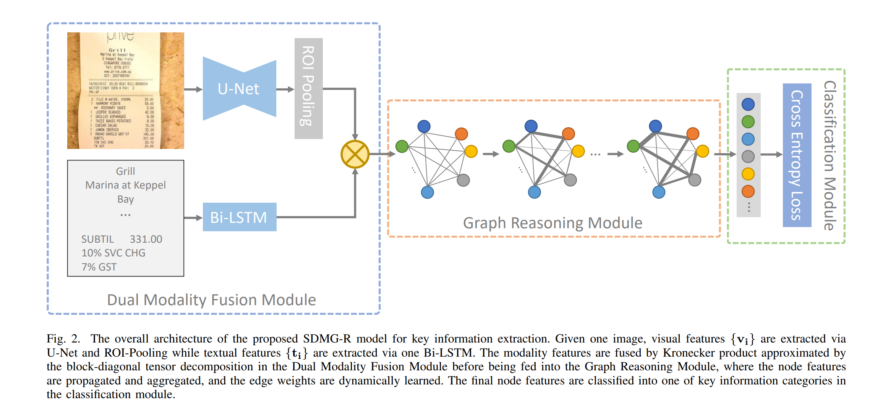

在前面的几篇文章中，我们结合代码介绍了关键信息提取(KIE)任务网络[SDMGR](https://arxiv.org/abs/2103.14470v1)(Spatial Dual-Modality Graph Reasoning for Key Information Extraction)的整个前向计算过程，包含了处理图片信息的主干网络U-Net，处理文字信息的LSTM，以及特征融合的图神经网络部分。今天就让我们继续看看SDMGR的损失函数以及模型评估部分吧。




# 1. 损失函数

损失函数部分的代码位于`ppocr/losses/kie_sdmgr_loss.py`


```

# 5.总结

今天这篇文章从从代码角度介绍了整个SDMGR网络的词嵌入，循环神经网络，特征融合以及图神经网络部分。至此我们已经完整介绍了整个网络的结构，可以看到SDMGR将`U-Net`和`LSTM`作为Encoder抽取特征，图神经网络作为残差连接块，最后使用全连接层使用Decoder输出分类的思路是非常清晰的，在图神经网络模块还使用了动态注意力机制来学习文字区域之间的空间信息。

下一篇文章会继续介绍损失函数与评估函数。

### 参考链接
1. https://en.wikipedia.org/wiki/Long_short-term_memory
2. https://zh.m.wikipedia.org/zh/%E5%85%8B%E7%BD%97%E5%86%85%E5%85%8B%E7%A7%AF
3. https://distill.pub/2021/gnn-intro/
4. https://www.bilibili.com/video/BV1iT4y1d7zP