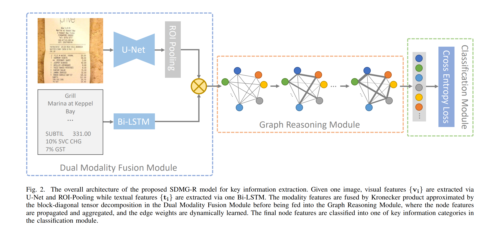
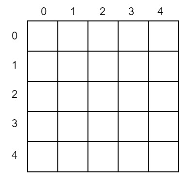
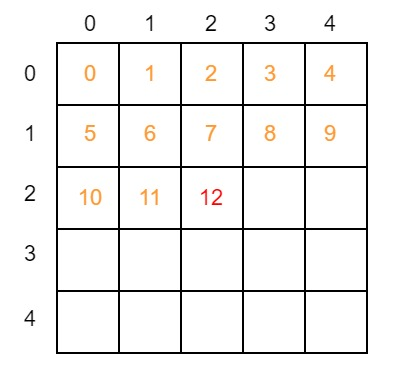
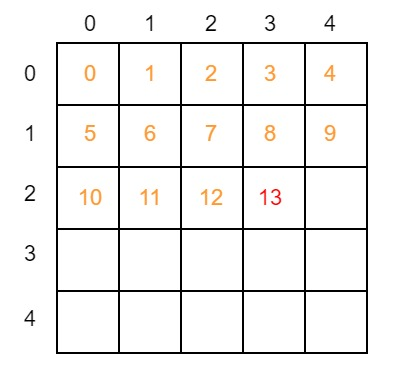

在前面的几篇文章中，我们结合代码介绍了关键信息提取(KIE)任务网络[SDMGR](https://arxiv.org/abs/2103.14470v1)(Spatial Dual-Modality Graph Reasoning for Key Information Extraction)的整个前向计算过程，包含了处理图片信息的主干网络U-Net，处理文字信息的LSTM，以及特征融合的图神经网络部分。今天就让我们继续看看SDMGR的损失函数以及模型评估部分吧。




# 1. 损失函数

损失函数部分的代码位于`ppocr/losses/kie_sdmgr_loss.py`。我们先来看一下损失函数的前向计算：
```python
def forward(self, pred, batch):
    # node_preds.shape = [node_num, class_num], 即每个节点的分类预测值
    # edge_preds.shape = [edge_num, 2]， 即每条边的分类预测值
    node_preds, edge_preds = pred
    # gts.shape = [batch_size, 300, 300], 即每个节点真实的分类
    # tag.shape = [batch_size. 2], 对每个batch，tag储存了两个信息：[节点数, 最长文字长度]
    gts, tag = batch[4], batch[5]
    # 将真实的节点标签从300 * 300的容器中拿出，形成形状为[batch_size, node_num, node_num + 1]的标签张量。
    # 其中每个batch第一列[node_num, 1]为节点自身分类，其余列组成的[node_num, node_num]矩阵为节点两两之间边的分类。
    gts = self.pre_process(gts, tag)
    node_gts, edge_gts = [], []
    for gt in gts:
        # 将节点分类的标签与边分类的标签分别存放
        node_gts.append(gt[:, 0])
        edge_gts.append(gt[:, 1:].reshape([-1]))
    node_gts = paddle.concat(node_gts)
    edge_gts = paddle.concat(edge_gts)

    # 过滤标签为ignore class的节点标签，默认为第0个class
    node_valids = paddle.nonzero(node_gts != self.ignore).reshape([-1])
    edge_valids = paddle.nonzero(edge_gts != -1).reshape([-1])
    # 对节点做CrossEntropyLoss
    loss_node = self.loss_node(node_preds, node_gts)
    # 对边做CrossEntropyLoss
    loss_edge = self.loss_edge(edge_preds, edge_gts)
    # 总loss为节点和边loss的加权和，默认权重都为1
    loss = self.node_weight * loss_node + self.edge_weight * loss_edge
    return dict(
        loss=loss,
        loss_node=loss_node,
        loss_edge=loss_edge,
        acc_node=self.accuracy(
            paddle.gather(node_preds, node_valids),
            paddle.gather(node_gts, node_valids)),
        acc_edge=self.accuracy(
            paddle.gather(edge_preds, edge_valids),
            paddle.gather(edge_gts, edge_valids)))
```
相对而言，SDMGR的损失函数是比较简单的。对于图神经网络输出的节点与边的分类，各自与标签做[交叉熵损失](https://en.wikipedia.org/wiki/Cross_entropy)即可。而总损失是节点与边两方面损失的加权和，这两个权重就都是超参数了，可以自由调整。结合现阶段的代码实现和实际训练来看，标签数据里并未包含边信息的分类时，直接将边损失的权重置0，只看节点损失即可。

# 2. 模型评估

模型评估对应的代码位置为`ppocr/metrics/kie_metric.py`。

SDMGR的评估采用了[F1 score](https://en.wikipedia.org/wiki/F-score)，即准确率(precision)与召回率(recall)的调和平均数(harmonic mean)，这也是相当常用的模型评估标准了。我们直接来看最核心的代码：
```python
def compute_f1_score(self, preds, gts):
    # 那些不参与模型评估的类们
    ignores = [0, 2, 4, 6, 8, 10, 12, 14, 16, 18, 20, 22, 24, 25]
    # 预测的第二个维度形状，也就是预测的类数
    C = preds.shape[1]
    # 从0到类数生成各个类的index，但是要剥离上述不参与评估的类
    classes = np.array(sorted(set(range(C)) - set(ignores)))
    # hist矩阵为混淆矩阵
    # gts.shape = [node_num]，是各个节点真实分类的index，然后各个index乘以了类数
    # preds.argmax(1).shape = [node_num]，是经过网络预测后各个节点的分类
    # hist.shape = [class_num, class_num]
    # 如果分类正确，则该节点对应位置上的加和数字该类别的(class_num + 1)倍。该值落在了hist矩阵的对角线上
    # 若分类错误，则加和的数字范围为 （class_num * class_index, class_num * (class_index + 1)), 落在hist矩阵的第class_index行
    hist = np.bincount(
        (gts * C).astype('int64') + preds.argmax(1), minlength=C
        **2).reshape([C, C]).astype('float32')
    # hist的对角线diag，即各个分类的ture positive
    diag = np.diag(hist)
    # hist.sum(1): hist矩阵按列求和，即该类所有的 ture positive + false nagative
    recalls = diag / hist.sum(1).clip(min=1)
    # hist.sum(0)：hist矩阵按行求和，即该类所有的positive（ture positive + false positive）
    precisions = diag / hist.sum(0).clip(min=1)
    f1 = 2 * recalls * precisions / (recalls + precisions).clip(min=1e-8)
    return f1[classes]
```

这里有两个值得关注的地方：

第一点，计算F1分数时，会剔除某些类。对应WildReceipt数据集，这里hardcode了一个ignore列表，该列表包含了数据集中分类为`Ignore`，`Other`,以及所有的`Key`分类。这表明了关键信息提取任务实际关心的是票据或文档中那些`Value`的准确度，比如消费金额啊，税额数字，而不是图像中信息的标题。如果你想将SDMGR应用在其他数据集上，一定要记得评估模型时要将hard code`ignores`数组替换成数据集对用的分类。

第二点，这里计算F1分数的过程手动实现了[混淆矩阵](https://en.wikipedia.org/wiki/Confusion_matrix)的计算，相当巧妙。首先将所有的分类index乘以分类数，然后加上了预测的分类结果，形成了一个`[node_num]`形状的list，然后对这个list中各个值求`bincount`，即计算list中各个数字出现的次数。因为这个list中最大的数也不会超过`(class_num * class_num)`，计算完`bincount`后的数组就可以reshape成一个`[class_num, class_num]`的`hist`混淆矩阵了。如果分类正确，那么该class对应的数字为`(class_num * class_index + class_index)`，正好落在`hist`矩阵的对角线上。也就意味着将对角线单独拿出，就正好对应了各个class被正确分类的次数，即`ture positive`，这是计算recall与precisions的分子。

如果预测分类错误，假设应该被分类为`class_a`的节点被错误分类为了`class_b`则加和的数字范围为`class_num * class_a + class_b`, 落在hist矩阵的第`class_a`行`class_b`列的位置，也就是说hist矩阵的第n行加和，即被分类为为`class_index`为n的总数，也就是`ture positive + false positive`

而hist矩阵的第n列，对应了第n类分类正确的数量，加上了本因被分为第n类缺分类错误的数量，即`ture positive + false nagative`

结合上述hist矩阵的对角线，按行求和以及按列求和，就可以轻松算出各个分类的recalls与precisions，进而求得F1 score了。

这个过程结合一个例子，使用图像的方法更容易理解： 假设现有5个类，index分别为`[0, 1, 2, 3, 4]`。那么hist矩阵将是一个5 * 5的矩阵



假设经过网络的前向计算，将某个标号为第2类的节点正确分类为2，那么代码中
```python
(gts * C).astype('int64') + preds.argmax(1)
```
该值的计算结果就是2 * 5 + 2 = 12。在hist矩阵中从左上角开始第13格(第一格从0开始)加1。从下图可以很明确地看出这格就是hist矩阵中第2行第2列，正好位于对角线上



如果某个节点标号本应为2，但被错误分类为3，那么就应该在hist矩阵中第2 * 5 + 3 = 13格子上加1：



该格是hist矩阵中第2行第3列。现在我们可以很简单地观察出，hist矩阵中第n行上所有的数据都代表了该节点的真实标号是第n类，而第m列上的数据代表了该节点经过网络前向计算后，被分类成了第m列。通过加和对角线，各行以及各列的总数，我们就能轻松计算出F1 score了。

# 3.总结

整个PaddleOCR实现的SDMGR网络代码解析到这就告一段落了。在[Transformer](https://arxiv.org/abs/1706.03762)架构出现后的这几年里，在NLP与CV领域的应用可谓是大杀四方，大有取代CNN与RNN之势。也正是因为Transformer架构的通用性和强劲的性能，最近类似于[ViLT](https://arxiv.org/abs/2102.03334)的基于Transformer的多模态模型可谓是百花齐放。而在此背景下，`SDMGR`仍然创新性地使用了图神经网络，融合了CNN与RNN处理地特征，结合对关键信息提取问题的诸多归纳偏置，以远小于Transformer的计算代价完成了对文档类图片的多模态KIE任务。虽然不及Transformer架构模型那用的通用，但其相同性能下简单的结构和较小的计算量使得在工业应用上也更加方便。

另外相当推荐大家阅读一下`ViLT`的论文，除了贡献了性能优越的多模态模型外，将这篇论文当作近几年的多模态文献综述也相当不错。也可以看看[朱毅老师在B站上的视频](https://www.bilibili.com/video/BV14r4y1j74y)

### 参考链接
1. https://en.wikipedia.org/wiki/Cross_entropy
2. https://en.wikipedia.org/wiki/F-score
3. https://en.wikipedia.org/wiki/Confusion_matrix
4. https://arxiv.org/abs/1706.03762
5. https://arxiv.org/abs/2102.03334
6. https://www.bilibili.com/video/BV14r4y1j74y