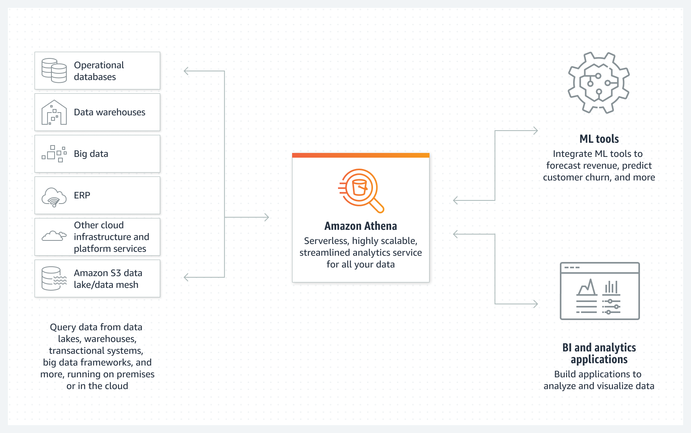

机器学习和大数据分析技术在过去十年内高速发展，到今天已经成为了现代化的服务与应用不可或缺的一部分。而搭建一套数据湖系统则是开始将机器学习与数据分析带到项目中的第一步。在这几篇文章里，我们将会学习到如何使用`AWS Athena`服务与`S3`文件存储搭建一套完整的数据湖解决方案。

# 1. AWS的数据湖
在AWS的这篇[文章](https://aws.amazon.com/big-data/datalakes-and-analytics/what-is-a-data-lake/)中，阐述了`数据湖`与`数据仓库`的主要区别。简单地概括一下即：
- “数据仓库”一般指存储结构化业务数据的系统，数据的Schema在数据存储时就已经确定(`schema-on-write`)，这种系统经常用来做批量的业务数据分析以及可视化。比较典型的例子就是[AWS Redshift](https://aws.amazon.com/redshift/)列式存储数据库，非常适合用来做业务的`OLAP`任务。
- “数据湖”则一般指不仅存储了业务上的关系型数据，还可以存储从移动设备，IoT设备或社交网络中获取的非关系型数据或指标数据(Metrics)，在储存到数据湖的时候并不指定数据的Schema，而仅在数据被读取的时候使用某种Schema去序列化数据湖中的数据(`schema-on-read`)，或者衔接使用`ETL`(Extract, transform, load)任务来清洗，分类数据。这样就大大降低了数据采集和存储端的复杂度，并最大限度地保留了数据的灵活性。比如同一份数据，即可以通过Athena使用SQL以及一个固定的Schema读取，也可以通过AWS Glue ETL Job转化成其他的数据结构。

从上面的描述可以看出，数据湖是一系列数据服务的中心。而从架构上，AWS数据湖是这样的:


在图中，整个数据湖及其下游架构包含了相当多的服务，而我们这次只需要了解构成数据湖的最基本服务:

- AWS S3: 文件存储系统，S3之于数据湖就好像`HDFS`之于`Hadoop`。在AWS数据湖概念中，基本上S3是所有数据存放的地方，也就是“湖”这个概念本身。而将数据放入“湖”中，即是简单地将文件通过API存入S3桶。
- AWS Athena: 在有了“湖”后，下一个需要解决的问题是如何从湖中获取数据。Athena基于[Trino/Presto](https://trino.io/)引擎和[Apache Spark](https://spark.apache.org/)框架实现了通过SQL来查询数据湖中的数据。
- AWS Glue: 包含在Glue中的服务非常多，而其中最关键的部分是`Data catalog`。如上文所提到的，数据湖是一个Schema-on-read系统，而AWS Glue就扮演了这个"Schema"的角色。当使用Athena查询数据时，需要选择定义在Glue中的Schema，将类似JSON文件的无Schema数据序列化后读取出来。


接下来我们着重介绍一下Athena以及Glue。

# 2. AWS Athena
AWS Athena在整个流水线中中起到了数据访问接口的作用：

对于类似于机器学习的下游任务来说，可通过Athena，从多种不同的入口获取序列化的数据。我们今天重点关注这些入口中的"S3 data lake"。

为了完成这一工作，Athena需要提供两项基本的能力:
1. 提供一套统一的SQL接口，使得下游服务可以方便地获取数据，而不必担心底层的数据到底是如何储存的。
2. 解析SQL语句并转换为具体的任务，从底层数据存储中获取对应的数据并序列化

为了解决这两个问题，Athena选择了`Trino/Presto`引擎。

## 2.1 Trino/Presto

`Trino`是一个开源分布式的SQL查询引擎。如果要用一句话概括它的作用，那就是`SQL on Everything`。这也是Trino的前身`Presto`在发布时的论文标题: [Presto: SQL on Everything](https://trino.io/Presto_SQL_on_Everything.pdf)

Trino提供了[ANSI SQL](https://blog.ansi.org/2018/10/sql-standard-iso-iec-9075-2016-ansi-x3-135/#gref)接口并可以将其转换为下游任务，从而实现将SQL应用在各种各样的数据结构上。整个Presto的架构和流程如下图所示:


一个query从SQL到任务的整个过程可以被描述为:
- 系统通过HTTP接收到SQL命令
- 解析SQL并生成和优化分布式执行计划
- 系统将计划分配给worker
- Worker接到任务后开始从外部储存读取数据
- 根据任务图，并行执行任务并将结果传递到执行下一阶段任务的worker，最终最后一个worker将结果返回

为了实现在各种不同的数据存储上进行SQL查询，Presto在整个流程中设计了几个Connector API接口。通过调用这些接口，Presto就会在任务整个生命周期中的各个环节从外部Connector获取必要信息，或是通过外部系统操作底层数据。这些接口是：
- Metadata API: 获取数据的metadata，其主要包括当前查询数据的Schema。
- Data Location API: 获取数据的位置，比如实现S3的Connector时，需要返回某张表在S3的具体地址。
- Data Source API: 从外部系统读取数据页。
- Data Sink API: 写数据到外部系统。

可以看得出，Athena通过为不同的数据源实现了这几个API给Trino提供了一个Connector，就可以完成上述任务。

说一些题外话：`Trino/Presto`一开始是2012年左右在Facebook内部开始的项目。Presto的创始团队是开源文化的拥趸，并且将Presto也打造成了一个开源项目，并和Airbnb, Dropbox, Netflix等公司的工程师们一起改善Presto。但对于Facebook来说打造完全开源的产品并维护一个良好的开源社区显然不是第一要务，相信大家从臭名昭著的[React BSD+Patent license](https://medium.com/@raulk/if-youre-a-startup-you-should-not-use-react-reflecting-on-the-bsd-patents-license-b049d4a67dd2)事件多少可以看得出Facebook的态度。虽然React的lisence最后还是改成了MIT，但Presto就没那么好运了。2018年Facebook开始收紧对Presto的约束并要求把代码的写权限开放给毫无经验的Facebook工程师们。五位创始人别无选择，只能离开Facebook并把Presto更名为Trino继续用开源社区的方式进行维护。更详细的故事可以看看Trino的[这篇博客](https://trino.io/blog/2022/08/02/leaving-facebook-meta-best-for-trino.html)。

# 3. AWS Glue
对于数据湖`Schema-on-read`的特性来说，如何维护这个"Schema"是一项关键的任务。向数据湖写数据的时候可以简单地将文件上传至S3，但经由Athena读取数据的时候必须指定数据的Schema，即向`Trino`的Metadata API提供对应数据的metadata。而[AWS Glue](https://aws.amazon.com/glue/)就承担了这一工作。

AWS Glue有诸多功能，今天我们着重在其中两个最重要的部分：`Glue Data Catalog` 和 `Glue Crawler`。他们的关系如下图: `Glue Crawler`爬取数据湖中数据的Schema，并储存于`Glue Data Catalog`中。


## 3.1 Glue Data Catalog

为了使用Athena查询数据，和普通的关系型数据库一样首先需要创建"Database"和"Table"，而"Table"本质就是对数据湖中数据规定的一系列Schema。最简单的创建方式是在Athena console中使用Trino SQL。假设我们有如下的账户数据(对于JSON格式的数据，Athena要求使用[ndjson](http://ndjson.org/)格式，每一行是一条完整的json)
```json
{"account_number":1,"balance":39225,"firstname":"Amber","lastname":"Duke","age":32,"gender":"M","address":"880 Holmes Lane","employer":"Pyrami","email":"amberduke@pyrami.com","city":"Brogan","state":"IL"}
{"account_number":6,"balance":5686,"firstname":"Hattie","lastname":"Bond","age":36,"gender":"M","address":"671 Bristol Street","employer":"Netagy","email":"hattiebond@netagy.com","city":"Dante","state":"TN"}
{"account_number":13,"balance":32838,"firstname":"Nanette","lastname":"Bates","age":28,"gender":"F","address":"789 Madison Street","employer":"Quility","email":"nanettebates@quility.com","city":"Nogal","state":"VA"}
```
该数据储存在`athena-data`bucket的`accounts`文件夹下，则运行SQL
```sql
CREATE EXTERNAL TABLE `accounts`(
  `account_number` int, 
  `balance` bigint, 
  `firstname` string,
  `lastname` string,
  `age` int,
  `gender` string,
  `address` string,
  `employer` string,
  `email` string,
  `city` string,
  `state` string)
ROW FORMAT SERDE 
  'org.openx.data.jsonserde.JsonSerDe' -- 指定SerDe
LOCATION
  's3://athena-data/accounts' -- 指定S3地址
```
这样，一张Glue Data Catalog的就创建完成了。注意与在`MySQL`中创建表不同的是，这里需要指定`ROW FORMAT`和S3`LOCATION`。其中`org.openx.data.jsonserde.JsonSerDe`代表使用内置的JSON序列化/反序列化去处理S3中的数据，如果源数据的格式不是JSON，而是诸如`csv`或`Parquet`之类的格式，则要指定对应的SerDe。

创建完成后，就可以使用Trino SQL在Athena中查询数据了:
```sql
SELECT * FROM "accounts" limit 10;
```
每次查询的结果都会保存为csv格式存放在指定的S3目录下。

## 3.1 Glue Crawler

手动使用SQL创建表很方便，但是仍然有很多问题:
- 如果底层json数据的schema有变化，例如新增字段了，需要手动维护表结构
- 数据查询时会扫描所有的json文件，因为Schema-on-read并不像传统SQL一样会建立index。数据插入时是没有Schema的，所以不具备动态维护index的条件

为了解决这些问题，我们可以使用Glue Crawler来自动爬取S3中数据的Schema，并为数据创建partition。

首先，我们为Crawler指定一个目标S3路径，比如
```
s3://athena-data/accounts/
```
以及输出的database，那么Crawler就会扫描`s3://athena-data/accounts/`下的文件(可以配置成仅扫描上次扫描以来的新增文件)，并在目标database中创建一张名为"accounts"的表(与S3目标地址最后一级目录名相同)。在扫描的过程中，crawler会自动按照文件的格式选取合适的SerDe进行序列化/反序列化，并提取文件中的字段形成对应的Schema储存在表结构中。

其次，为了提高查询时的效率，我们需要为table创建partition。Partition是通过文件夹结构创建在数据某些字段上的。例如上述的`accounts`数据，如果现在想按照"state"和"city"字段创建partition，使得我们在查询某个"city"数据时不会去扫描别的city目录下的数据，我们需要将同一个state和city的数据组织在同一个目录下，例如:
```
s3://athena-data/accounts/state=va/city=nogal/accounts.json
s3://athena-data/accounts/state=tn/city=dante/accounts.json
```
使用这种形如`key=value`格式的文件夹名，那么crawler在爬取数据的时候就会自动在data catalog中加入对应的partition。当我们运行SQL

```sql
SELECT * FROM "accounts" where city='nogal' limit 10;
```
加入其他state文件夹中不存在名为'city=nogal'的文件夹了，那么这次查询Athena只会扫描`s3://athena-data/accounts/state=va/city=nogal/`下的文件。

此时我们查看表`accounts`的创建DDL
```sql
SHOW CREATE TABLE `accounts`;
```
可以得到如下结果
```sql
CREATE EXTERNAL TABLE `accounts`(
  `account_number` int  COMMENT 'from deserializer', 
  `balance` bigint  COMMENT 'from deserializer', 
  `firstname` string  COMMENT 'from deserializer',
  `lastname` string  COMMENT 'from deserializer',
  `age` int  COMMENT 'from deserializer',
  `gender` string  COMMENT 'from deserializer',
  `address` string  COMMENT 'from deserializer',
  `employer` string  COMMENT 'from deserializer',
  `email` string  COMMENT 'from deserializer')
PARTITIONED BY ( 
  `city` string,
  `state` string)
ROW FORMAT SERDE 
  'org.openx.data.jsonserde.JsonSerDe' 
WITH SERDEPROPERTIES ( 
  'paths'='account_number,balance,firstname,lastname,age,gender,address,employer','email') 
STORED AS INPUTFORMAT 
  'org.apache.hadoop.mapred.TextInputFormat' 
OUTPUTFORMAT 
  'org.apache.hadoop.hive.ql.io.HiveIgnoreKeyTextOutputFormat'
LOCATION
  's3://athena-data/accounts'
TBLPROPERTIES (
  'CrawlerSchemaDeserializerVersion'='1.0', 
  'CrawlerSchemaSerializerVersion'='1.0', 
  'UPDATED_BY_CRAWLER'='accounts-crawler', 
  'averageRecordSize'='374', 
  'classification'='json', 
  'compressionType'='none', 
  'objectCount'='1309', 
  'recordCount'='1309', 
  'sizeKey'='630830', 
  'typeOfData'='file')
```
可以看到除了一些crawler的元信息外，主要多了`PARTITIONED BY`字段。并且将来有更多数据加入数据湖时，定期使用Crawler爬取数据可以自动更新表结构和Partition。需要注意的是如果有新的partition文件夹产生了，那么这些新partition中的数据在被Crawler爬取或手动增加partition之前，是无法被查询到的。

# 4. 总结
这次我们从总体上了解了构成AWS数据湖的几个最基本的服务：AWS S3, Athena和Glue，并介绍了他们各自在整个数据湖架构中的位置和作用。在下篇文章中，我们详细了解如何搭建这一套解决方案，并通过解决一些实际的问题:
- 如果每一条数据都是一个ndjson文件，那么就算使用了partition，一个partition内的文件数过多是否会影响查询性能？
- 通过Athena查询时使用了不在partition上的`where`条件，有没有办法有效地降低文件扫描的数量和耗时？

# 参考文献

1. https://aws.amazon.com/big-data/datalakes-and-analytics/what-is-a-data-lake/
2. https://aws.amazon.com/redshift/
3. https://trino.io/
4. https://spark.apache.org/
5. https://trino.io/Presto_SQL_on_Everything.pdf
6. https://aws.amazon.com/glue/
7. http://ndjson.org/