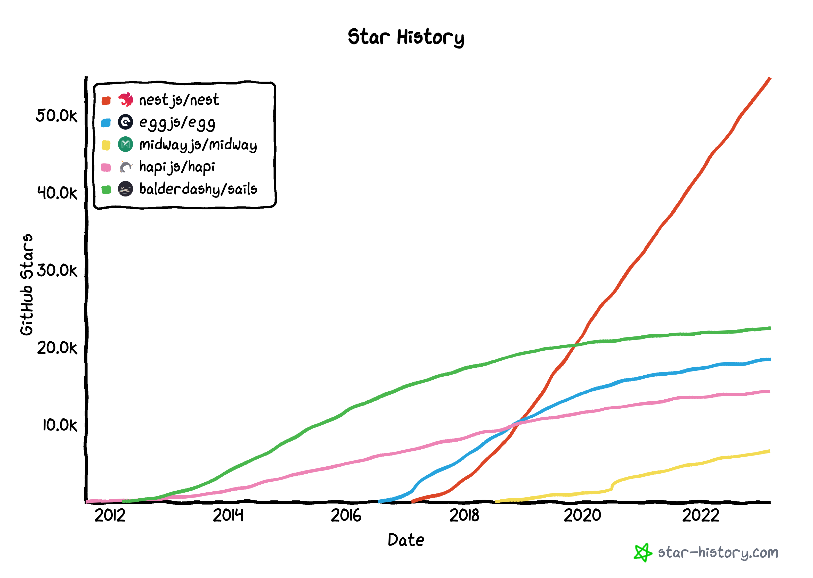
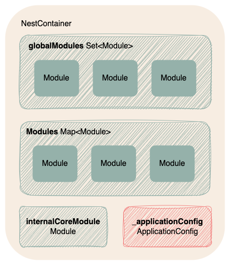
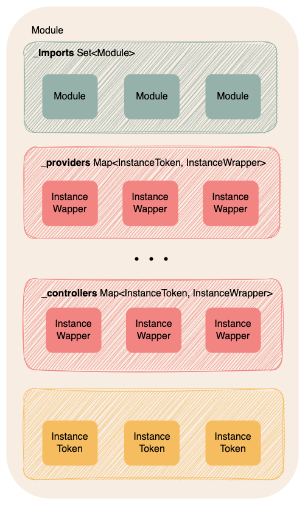
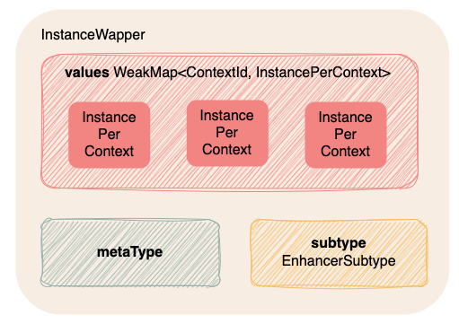

如果要说近几年NodeJS开发者中最流行和热门的MVC框架，那非[NestJS](https://github.com/nestjs/nest)莫属了。下图是2012年至2023年Github上各个知名NodeJS Web框架的Star数趋势：


我们可以直观得看出，从2018年以来，`NestJS`就异军突起，力压`Egg`，`Hapi`和`Sails`，仅用两年时间就稳居最受环境的NodeJS框架至今。


NestJS作为一个受[Spring](https://github.com/spring-projects/spring-framework)和[Angular](https://github.com/angular/angular)启发的框架，实现了非常优秀的依赖注入功能。那我们今天就从NestJS的启动过程开始，了解一下他是如何做好依赖注入这一件“小”事的吧。

*本文基于NestJS的[v9.3.9](https://github.com/nestjs/nest/tree/v9.3.9)版本*

# 1. 名词解释

在我们开始读源码之前，不妨先梳理一下源码中出现的许多类的概念吧。这样在源码中遇到各式各样的变量和类，也能做到心中有数他们是用来做什么的。

## 1.1 代码结构

作为一个[Monorepo](https://monorepo.tools/)，Nest各个模块的源码在[packages](https://github.com/nestjs/nest/tree/v9.3.9/packages)这个文件夹内。

```
packages
├── common
├── core
├── microservices
├── platform-express
├── platform-fastify
├── platform-socket.io
├── platform-ws
├── testing
└── websockets
```
其中有许多诸如[@nestjs/testing](https://www.npmjs.com/package/@nestjs/testing)和[@nestjs/testing](https://www.npmjs.com/package/@nestjs/microservices)包。但我们今天将重点放在最核心的[@nestjs/core](https://www.npmjs.com/package/@nestjs/core)和[@nestjs/common](https://www.npmjs.com/package/@nestjs/common)上。

## 1.2 容器类

**NestContainer**

容器是实现依赖注入的关键，而[NestContainer](https://github.com/nestjs/nest/blob/v9.3.9/packages/core/injector/container.ts#L24)是整个NestApp最外层的容器。其中除了几个类似于`ModuleCompiler`的工具外，主要包含了几个指向配置和具体模块的容器集合。
- globalModules: 存放全局模块
- modules: 存放用户定义的模块
- internalCoreModule: 存放内置模块
- _applicationConfig: 存放配置，主要包括`globalPipes`，`globalFilters`，`globalInterceptors`等等的全局配置

可以看到，`NestContainer`作为一个最外层的容器，本身的主要作用就是用来存放配置以及各个模块的，可以说是容器的容器。



**Module**

在NestJS中，用户编写的各类`Controller`和`Service`都组织在一个[Module](https://github.com/nestjs/nest/blob/v9.3.9/packages/core/injector/module.ts#L48)容器中。该容器不仅承载了我们编写的代码，也包含着模块与模块之间的依赖关系。



该容器的结构与我们在NestJS代码中定义一个Module的方式高度一致，
```js
@Module({
  imports: [...],
  controllers: [...],
  providers: [...],
  exports: [...].
})
export class CatsModule {}
```
其中`_imports`中存放的是对其他模块的引用，`exports`中存放的[InstanceToken](https://github.com/nestjs/nest/blob/v9.3.9/packages/common/interfaces/modules/injection-token.interface.ts#L7)(即方便其他模块用来注入依赖的Token，而不是服务实例本身)之外，其他的`_providers`, `_injectables`, `_middlewares`和`_controllers`均指向了`InstanceWrapper`集合，即指向了真实的实例。

**InstanceWrapper**

[InstanceWrapper](https://github.com/nestjs/nest/blob/v9.3.9/packages/core/injector/instance-wrapper.ts#L59)是对可注入对象实例的封装。



可能有同学会有疑问，为什么实例化的对象需要使用一层封装而不是直接储存该对象呢？主要出自于几个方面考虑:

1. 存放元数据: 其中最简单直接的原因是除了实例外，`InstanceWrapper`容器还存放了诸如`metaType`，即可注入对象的Class，用以创建对象，以及`subtype`，用以标记可注入对象是否为一个`guard`, `interceptor`, `pipe`或者`filter`这样的元数据。
2. 循环依赖问题: 为了解决循环依赖问题，整个NestJS将可注入对象的实例化分为了两步。第一步先通过原型链创建出该对象的实例，但不注入任何依赖，所以这一步我们可以获得所有服务的实例引用而不需要担心循环依赖的问题。第二步再向各个半成品实例注入依赖，此时服务的所有依赖不管有没有循环依赖的问题，均已有实例引用可以直接注入。而`InstanceWrapper`就是一个存放半成品实例和最终实例的容器。
3. Scope隔离问题: NestJS支持在不[不同Scope创建可注入对象](https://docs.nestjs.com/fundamentals/injection-scopes)。其中Scope又分为三种：
- Default: 全局的单例，生命周期和整个nestApp一样长
- Request: 每个request生成一个单例，该单例在request结束后被销毁
- Transient: 每次注入时产生一个新的实例

所以当依赖注入的时候，需要根据当前Scope，注入一个对应的实例。`InstanceWrapper`中对象的实例实际储存在一个`WeakMap`中，将实例与他对应的`ContextId`做一一映射。

**InstanceLinksHost**

NestJS除了普通的依赖注入外，还提供了一个[Standalone](https://docs.nestjs.com/standalone-applications)模式，即绕过依赖注入的流程，直接从NestApp中获取依赖的实例
```js
const app = await NestFactory.createApplicationContext(AppModule);
const tasksService = app.get(TasksService);
```
从上文中我们知道，Nest的依赖结构是一个树状结构，从根Module开始，不断地向imports Module的方向延伸。这是否意味着我们每次通过Standalone模式获取依赖都需要遍历一遍整颗依赖树来搜索呢？实际上Nest将整颗依赖树拍平，把所有可注入对象的引用放到了[InstanceLinksHost](https://github.com/nestjs/nest/blob/v9.3.9/packages/core/injector/instance-links-host.ts#L16)的Map中，这样就可以在O(1)时间复杂度内找到对应的依赖了。

# 2. 启动流程

在对NestJS内部使用的容器有了初步的认识后，我们就可以开始跟随其启动过程阅读NestJS的源码了。当我们使用形如
```js
await NestFactory.create(AppModule)
```
的代码启动NestJS时，调用了[NestFactoryStatic.create](https://github.com/nestjs/nest/blob/v9.3.9/packages/core/nest-factory.ts#LL69)方法。该方法的关键代码如下
```js
public async create(...){
    ...
    // 创建配置和容器的实例
    const applicationConfig = new ApplicationConfig();
    const container = new NestContainer(applicationConfig);
    ...

    // 初始化模块，实例化对象，完成依赖注入
    await this.initialize(
      moduleCls,
      container,
      graphInspector,
      applicationConfig,
      appOptions,
      httpServer,
    );

    // 创建NestApp实例并为其创建代理
    const instance = new NestApplication(
      container,
      httpServer,
      applicationConfig,
      graphInspector,
      appOptions,
    );
    const target = this.createNestInstance(instance);
    return this.createAdapterProxy<T>(target, httpServer);
  }
```
可以看到该方法主要是将一些基础的容器创建出来后，进入了下一步初始化。而整个依赖树的解析，实例化和依赖注入，都包含在这个[initialize](https://github.com/nestjs/nest/blob/v9.3.9/packages/core/nest-factory.ts#L191)方法中。核心代码如下
```js
private async initialize(...) {
    ...

    const injector = new Injector({ preview: options.preview });
    const instanceLoader = new InstanceLoader(...);
    const metadataScanner = new MetadataScanner();
    const dependenciesScanner = new DependenciesScanner(...);
    ...
    try {
      // 用过模块间的依赖关系，创建出依赖树
      await dependenciesScanner.scan(module);
      // 实例化模块中的可注入对象，并进行依赖注入
      await instanceLoader.createInstancesOfDependencies();
      // 应用全局enhancer
      dependenciesScanner.applyApplicationProviders();
    } catch (e) {
      this.handleInitializationError(e);
    }
  }
```
可以看到这里主要做了两件事，实例化一些工具并执行真正的依赖树创建和依赖注入。首先，我们解释一下这里创建的四个工具实例分别是用来做什么的

- **Injector**: 依赖注入工具，几乎没有成员变量，主要的工作是根据将代码中注册在各个module中的Class进行实例化，注入该类的依赖。Injector本身只负责依赖注入，并不负责依赖关系的扫描。
- **InstanceLoader**: 调用上述的Injector,对一个Nest module的`providers`, `injectables`和`controllers`进行实例化和依赖注入.
- **MetadataScanner**: 扫描一个类型的整个原型链，返回所有的方法名。
- **DependenciesScanner**: 从root module开始，深度优先扫描整个依赖树，将扫描到的模块注册在NestContainer中。

直接看着四个工具类的描述可能相当不直观，没办法一下子理解他们各自的功能。接下来我们就重点关注一下[dependenciesScanner.scan](https://github.com/nestjs/nest/blob/v9.3.9/packages/core/scanner.ts#L75)和[instanceLoader.createInstancesOfDependencies](https://github.com/nestjs/nest/blob/v9.3.9/packages/core/injector/instance-loader.ts#L25)这两个方法，梳理一下依赖注入的过程吧。

## 2.1 依赖树构造
[dependenciesScanner.scan](https://github.com/nestjs/nest/blob/v9.3.9/packages/core/scanner.ts#L75)方法非常简单：
```js
public async scan(module: Type<any>) {
    // 注册核心模块
    await this.registerCoreModule();
    // 深度优先扫描模块，构造模块依赖树
    await this.scanForModules(module);
    // 扫描模块的依赖，向容器注册
    await this.scanModulesForDependencies();
    this.calculateModulesDistance();

    this.addScopedEnhancersMetadata();
    this.container.bindGlobalScope();
  }
```

**registerCoreModule**

在注册其余模块前，Nest需要先初始化核心模块。其主要包括`ExternalContextCreator`, `ModulesContainer`, `HttpAdapterHost`等Providers。由于这次的重点是依赖注入的实现，对于核心模块的功能先不赘述。

**scanForModules**


